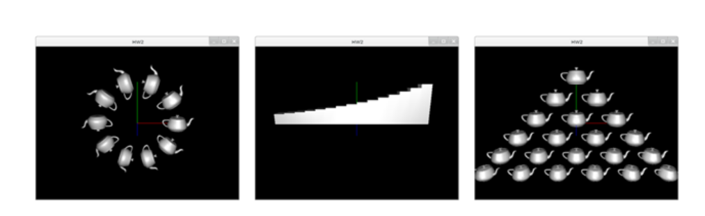
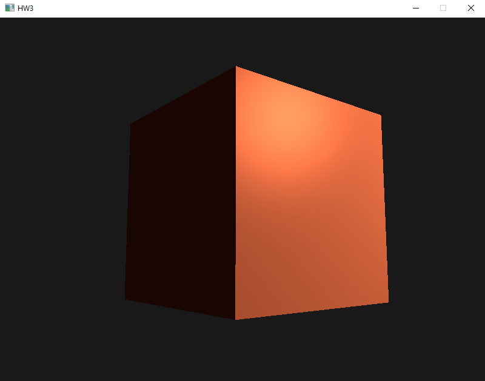

# COSC4370 Homework

## Overview
A repository to submit my homework for COSC 4370 (Interactive Computer Graphics) at UH with Zhigang Deng, using OpenGL. Most of the boiler-plate code was provided
for the assignments, and the task was to render different objects. For example, the goal of [HW4](hw4/) was to implement a raytracer with different shading techniques.
I don't have the actual assignments saved, but I have found references to them.

## [HW1](hw1/)
The goal of this [assignment](https://github.com/GeorgeNav/COSC4370/blob/master/hw1/hw1.pdf) was to draw the first quadrant of a circle in C++.

  

## [HW2](hw2/)
The goal of this [assignment](https://github.com/GeorgeNav/COSC4370/blob/master/hw2/hw2.pdf) was to create and manipulate shapes to look like the provided
images using OpenGL.

  

## [HW3](hw3/)
The goal of this [assignment](https://github.com/GeorgeNav/COSC4370/blob/master/hw3/hw3.pdf) was to implement [Phong shading](https://en.wikipedia.org/wiki/Phong_shading)
on a cube. Additionally, I added a feature to "click and drag" the camera around, which was more convenient while testing.

  

## [HW4](hw4/)
The goal of this [assignment](https://github.com/GeorgeNav/COSC4370/blob/master/hw4/hw4.pdf) was to build a raytracer with by implementing and combining
shading techniques, first starting with a Phong shader, then adding shadows, and finally combining the two with reflections. The final result is below:

  
