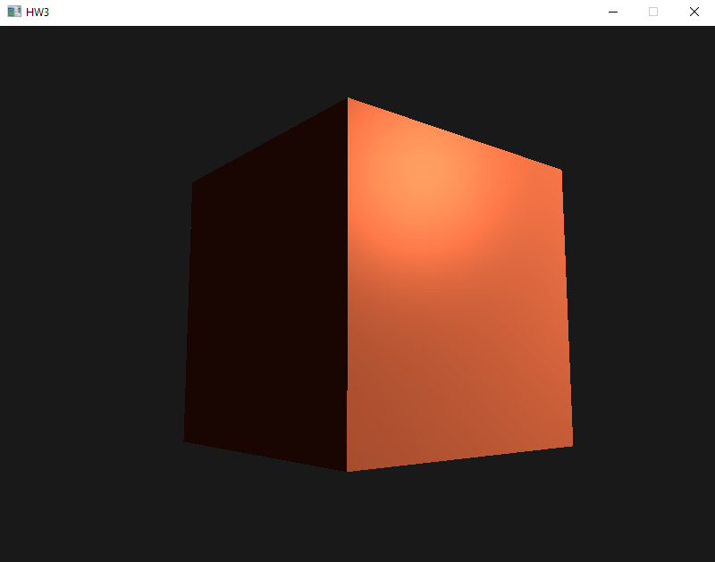

# HW3

## Notes

* This project uses `glew32s.lib` instead of `glew32.lib`, it didn't work otherwise.
* I've added a "click and drag" feature to move the camera, so now it only rotates if left-clicking.

## Screenshot

The screenshot included in this folder has been displayed below for your convenience:

