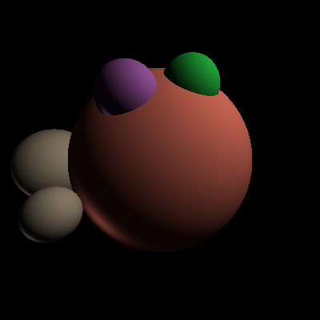
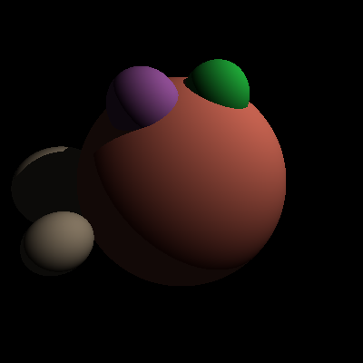
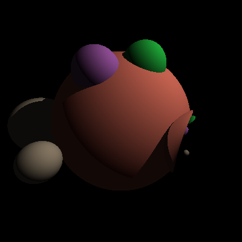

# HW4

## Notes

* This project uses `eigen3.3.7` instead of `eigen3.1.1`.
* Fields added to `Shape.h` : `Vector3d color` and `bool isReflective` (also added to `HitRecord`)
* Custom files: `Phong.h` (for Phong shading), `Shadow.h` (for calculating shadows)

## Images

The images included in this repository have been displayed below for your convenience:

1. Phong Shading

    

2. Shadows

    

3. Reflections

    
